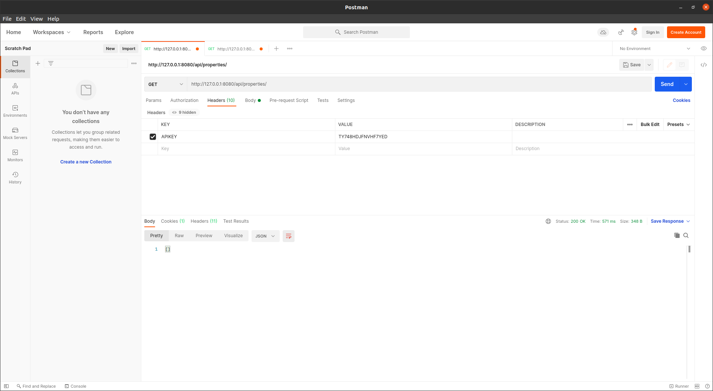

# PROPERTY MANAGEMENT API ENDPOINTS 

This is application runs on embedded tomcat.

## Run the application
- Change directory to project folder and  run `mvn clean install`  to create jar file. This will run all the tests and create a jar file.
- Rename your war file to `java -jar target/property-0.0.1-SNAPSHOT.jar`. 
- Go to `http://127.0.0.1:8080/api/swagger-ui.html#/` for Swagger api documentation.
- Include a HEADER named `APIKEY` with the value from `src/main/resources/application.yml` or you can change it.

## What's Included 
- Properties Management CRUD operations.
- Include HEADER in your requests 

LIST

## Used Tech
- Spring Boot
- Hibernate
- H2 Database
- SWAGGER Documentation

